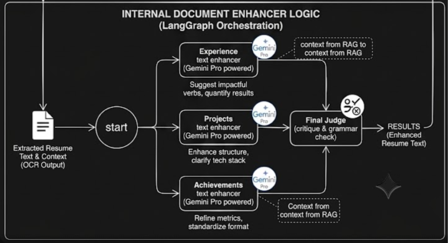

# Graph CV 🚀 | AI-Powered Resume Roaster & ATS Evaluator


**Graph CV** is a high-performance, asynchronous AI platform designed for precise ATS evaluation, resume roasting, and targeted enhancements. Built to achieve **100% layout retention** of both resumes and Job Descriptions (JDs), it utilizes image-based multimodal processing to bypass traditional, error-prone text parsers. 

By decoupling heavy LLM processing from the main application thread using a **BullMQ** message queue and **LangGraph** multi-agent pipelines, this platform ensures a seamless, non-blocking user experience with 99.9% task reliability.

---

## 🌐 Live Preview
Experience the platform live here: **[graph-cv-frontend.vercel.app](https://graph-cv-frontend.vercel.app)**

---

## ✨ Core Features

* **Multimodal Data Extraction:** Bypasses standard PDF parsers by uploading documents to Cloudinary as images, using the Gemini Vision API for pixel-perfect layout and context retention.
* **Resume Roaster:** Deep-dives into document flaws, aggressively flagging vague bullet points, missing quantifiable metrics, and weak action verbs.
* **Resume Enhancer:** Processes and rewrites specific document sections in parallel using LangGraph to elevate overall ATS impact and readability.
* **ATS Evaluator:** Compares extracted resume data against targeted Job Descriptions (JDs) to generate precise match metrics and compatibility scores via MongoDB caching.
* **Client-Side LaTeX Editor:** Empowers users to make immediate formatting and content adjustments using an integrated **Monaco Editor**. It shifts compilation overhead entirely to the client (zero server overhead), rendering PDF changes instantly.

---

## 🏗️ System Architecture & Workflow

GraphCV is built on a scalable, asynchronous architecture powered by the Gemini Pro API, LangGraph, MongoDB, BullMQ, and Redis. The platform processes heavy AI generation and evaluation tasks asynchronously to prevent timeouts and manage API rate limits.

### Main System & Data Flow

This diagram illustrates the end-to-end data flow and job lifecycle of GraphCV, from user upload to final result delivery:


1. **Image Uploads (via Cloudinary APIs)**: Users upload resume and JD images, which are securely hosted on Cloudinary.
2. **Job Creation (Queued)**: Job metadata (JOB ID, Cloudinary URLs, context) is saved to MongoDB. The JOB ID is immediately returned to the client.
3. **Asynchronous Processing (BullMQ & Redis)**: Jobs are queued and picked up by a worker pool, decoupling the AI workload from the API response. Workers pull the secure URLs and pass the raw image data to the multi-agent orchestrator.
4. **LangGraph AI Orchestration**: Extracted data is fed into a complex, multi-agent AI pipeline managed by LangGraph. This orchestrator routes data through multiple specialized agents (e.g., Roaster, ATS Evaluator, and the core Parallel Text Enhancers) before a **Final Judge Agent** aggregates and critiques the output.
5. **Result Aggregation & Client Delivery**: Enhanced text and ATS scores are saved to MongoDB. The client fetches the completed job, and the final optimized resume is rendered in the Monaco Editor.

---

### 🚀 Deep Dive: Text Enhancer Sub-Pipeline

GraphCV goes beyond simple rephrasing; it utilizes a sophisticated multi-agent pipeline to quantify impact, optimize verbs, and optimize for technical skills.



#### **The Enhancer Workflow:**

The raw, extracted text block is passed to the **Multi-Agent Orchestrator (Gemini Pro)**, which manages three specialized agents operating in parallel:

1. **Agent 1: Skill & Tool-Specific Text Enhancer (Sub-Architecture)**: Utilizes a Skill-Aware Rephraser and RAG to analyze the user's skillset, rephrasing for technical domain relevance. The result is optimized by Keyword & Level Optimization Logic.
2. **Agent 2: Impact Quantification Agent**: Identifies key accomplishments and suggests quantifiable metrics (e.g., converting "manual to automated" into "orchestrated automated pipelines, reducing manual effort by 20+ hours/week").
3. **Agent 3: Action Verb Optimization Agent**: Analyzes verb usage and suggests stronger, results-oriented alternatives tailored to the technical role (e.g., "worked on" -> "architected").

All agent outputs are synthesized and critiqued by the **Final Judge Agent** to ensure consistency and grammar before being returned as the consolidated Enhanced Text Block.

---

## 🛠️ Tech Stack

* **Frontend:** React.js, Tailwind CSS v4, Monaco Editor
* **Backend:** Node.js, Express.js
* **Database:** MongoDB
* **Asset Storage:** Cloudinary
* **Queue System & State:** BullMQ, Redis
* **AI / LLM:** Google Gemini API, LangGraph
* **Infrastructure:** Docker (for containerized background workers)

---

## 🔮 Future Roadmap (Coming Soon)

We are constantly iterating to make Graph CV the ultimate career engineering tool. Planned additions include:

* **Robust CI/CD Pipelines:** Implementing GitHub Actions for automated linting, testing, and zero-downtime deployments to ensure production stability.
* **Job Board Browser Extension:** A 1-click Chrome/Edge extension to instantly grab Job Descriptions directly from LinkedIn, Indeed, or YC Work at a Startup, piping them straight into the ATS Evaluator.
* **Advanced User Analytics Dashboard:** Track ATS compatibility scores over time, visualize keyword gaps, and monitor your overall "hireability" index based on industry trends.
* **Direct Cloud Integrations:** Seamlessly import existing resumes from Google Drive, Notion, or directly sync with your LinkedIn profile data.
* **A/B Resume Testing:** Generate and manage multiple variations of your resume targeted at different roles (e.g., Frontend vs. Full-Stack), tracking which variation yields the highest ATS match rate.

---

## 🚀 Getting Started

Follow these instructions to set up and run the system on your local machine.

### Prerequisites

* [Node.js](https://nodejs.org/en/) (v18 or higher)
* Redis (Running locally or via Docker)
* MongoDB (Local instance or MongoDB Atlas)
* Google Gemini API Key
* Cloudinary Account

### 1. Clone the Repository

```bash
git clone [https://github.com/lucky-ali-786/graph-cv.git](https://github.com/lucky-ali-786/graph-cv.git)
cd graph-cv
```

### 2. Install Dependencies

Install the required packages for both the backend and frontend:

```bash
# Install backend dependencies
cd backend
npm install

# Install frontend dependencies
cd ../frontend
npm install
```

### 3. Environment Variables

Create a `.env` file in the `backend` directory and configure your API keys and ports:

```env
PORT=5000
GEMINI_API_KEY="your_gemini_api_key"
REDIS_URL="redis://127.0.0.1:6379"
```

### 4. Run the Development Servers

Because of the decoupled architecture, you need to run the backend server, the background queue worker, and the frontend client simultaneously.

**Terminal 1: Start the Backend Server**
```bash
cd backend
npm run dev
```

**Terminal 2: Start the Background Worker**
```bash
cd backend
npm run worker
```

**Terminal 3: Start the React Frontend**
```bash
cd frontend
npm run start
```
